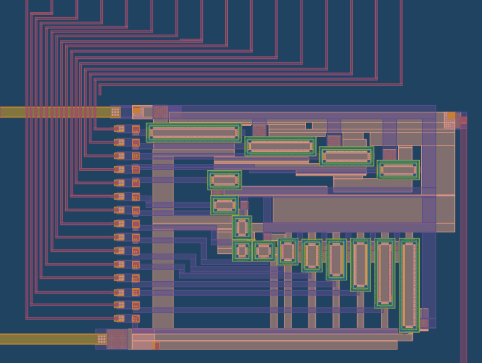
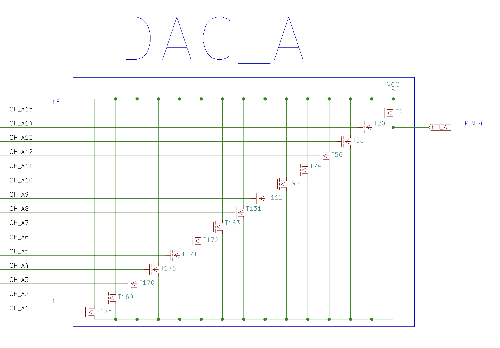
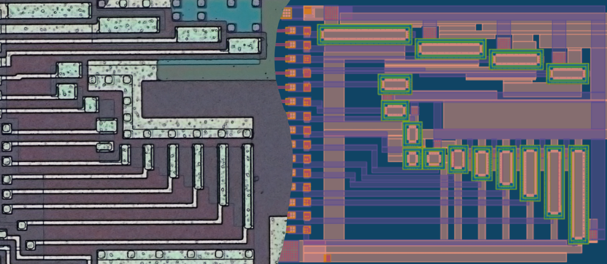
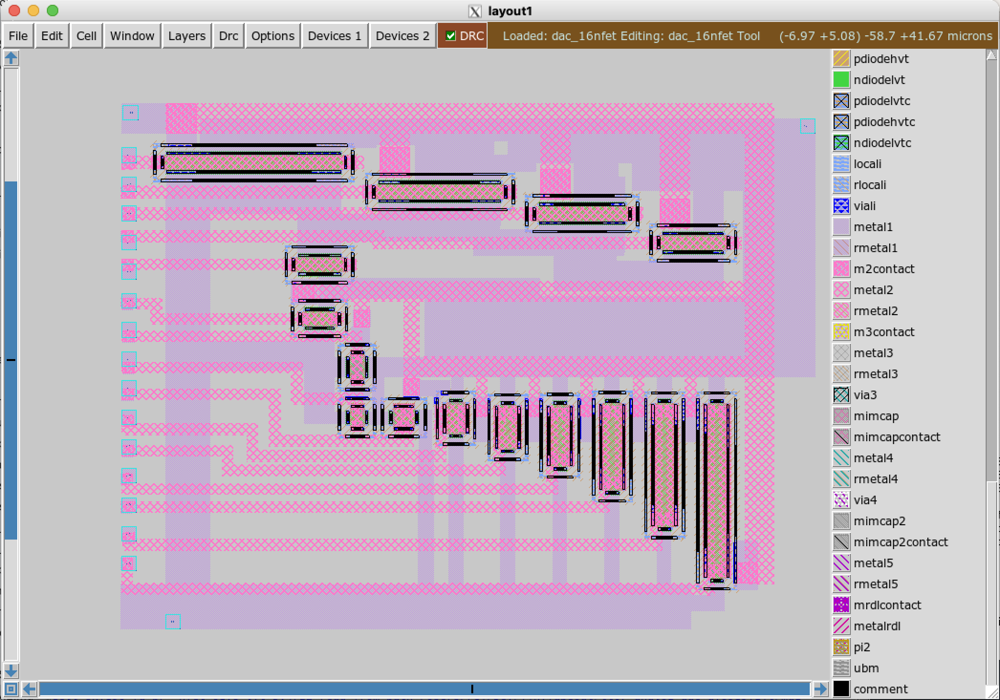
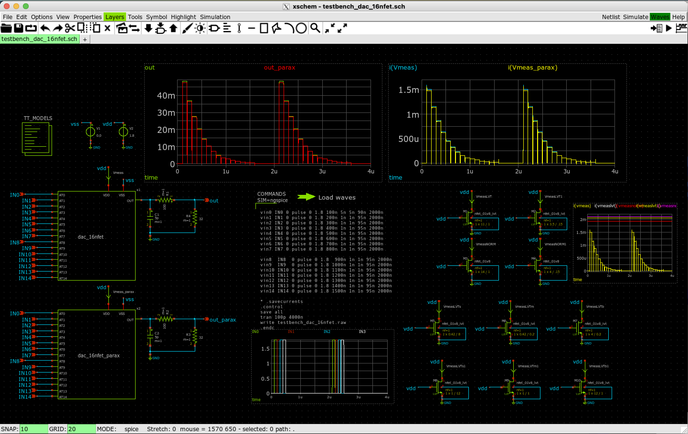
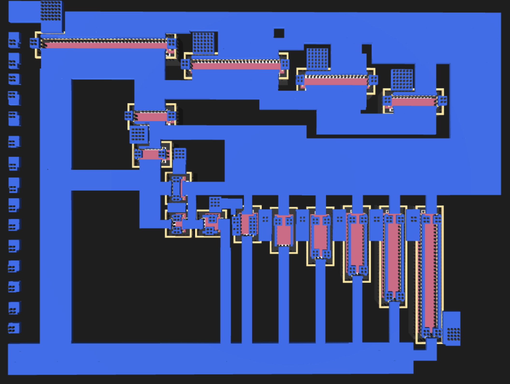
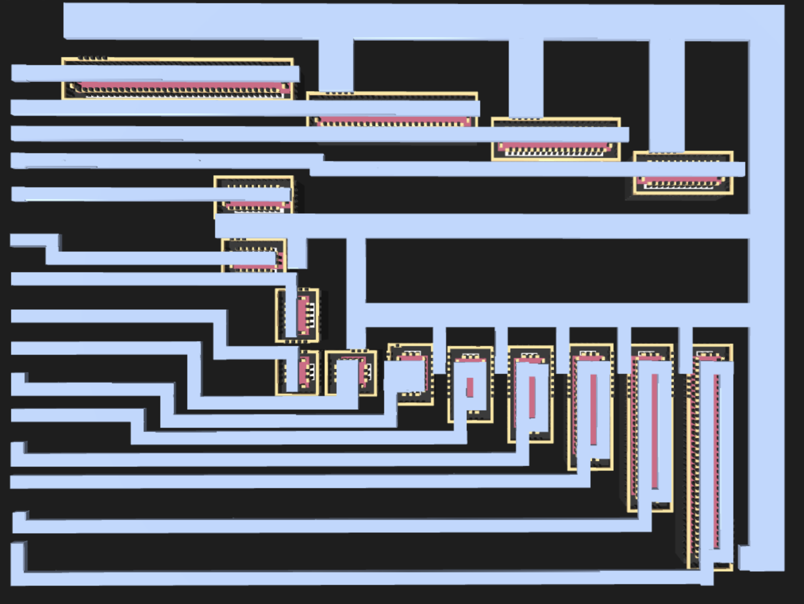
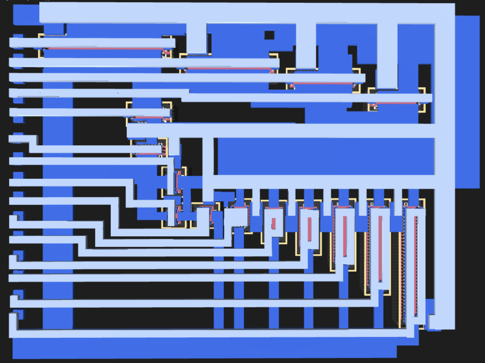

 

# Analog DAC for AY-891x family of Programmable Sound Generators

Recreation of the logarithmic 4-bit current steering DAC from AY-8910/AY-8912/AY-8913. Inspired and informed by silicon [reverse engineering](https://github.com/lvd2/ay-3-8910_reverse_engineered) of the orginal chip.

This work was done as excercise for [Zero To ASIC Analog course](https://zerotoasiccourse.com/#asic-def) and will be part of the open-source silicon for [AY-8913](https://github.com/rejunity/tt05-psg-ay8913) and potentially [SN76489](https://github.com/rejunity/tt05-psg-sn76489) unless I manage BJT DAC for it. Also check open-source silicon effort for [Z80](https://github.com/rejunity/z80-open-silicon) CPU.

### Silicon

    

- [Inspect chip in 3D](https://gds-viewer.tinytapeout.com/?model=https://rejunity.github.io/tt07-analog-dac-ay8913/tinytapeout.gds.gltf)
- [Inspect schematics](https://xschem-viewer.com/?file=https%3A%2F%2Fgithub.com%2Frejunity%2Ftt07-analog-dac-ay8913%2Fblob%2Fmain%2Fxschem%2Fdac_16nfet.sch)
- [Read the documentation for the project](docs/info.md)

### Simulation with parasytics extracted

## The original DAC from the 80ies
4-bit to 16 lines decoder on the left side. 16 current steering transistors of the different size form the DAC on the right. Output is in the top right corner.

    

### Reverse engineered schematics by lvd2
Yeah, it is just bunch of transistors connected in parallel. The real magic is in the **width** & **length** of their gates.

    

### Compare old and new

## Magic

    
    
    

# What did I learn?

# What is Tiny Tapeout?

Tiny Tapeout is an educational project that aims to make it easier and cheaper than ever to get your digital designs manufactured on a real chip.

To learn more and get started, visit https://tinytapeout.com.

## Analog projects

For specifications and instructions, see the [analog specs page](https://tinytapeout.com/specs/analog/).

## Resources

- [FAQ](https://tinytapeout.com/faq/)
- [Digital design lessons](https://tinytapeout.com/digital_design/)
- [Learn how semiconductors work](https://tinytapeout.com/siliwiz/)
- [Join the community](https://tinytapeout.com/discord)
- [Build your design locally](https://docs.google.com/document/d/1aUUZ1jthRpg4QURIIyzlOaPWlmQzr-jBn3wZipVUPt4)
